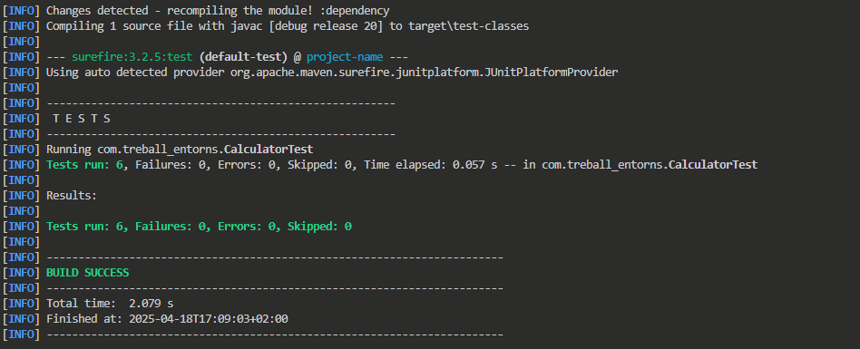
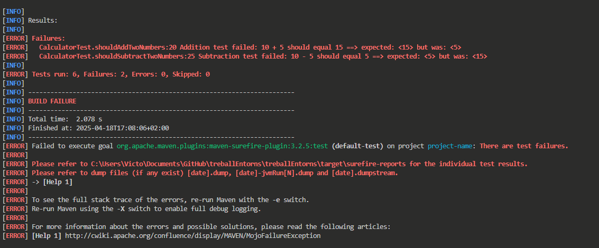

# Documentació del Test de la Classe Calculator

Aquest document proporciona una visió general del test unitari implementat per a la classe `Calculator`, que realitza operacions aritmètiques bàsiques. El test està escrit en Java i utilitza el framework JUnit 5 per assegurar la seva funcionalitat.

## Descripció de la Classe Calculator

La classe `Calculator` permet executar operacions aritmètiques bàsiques com suma, resta, multiplicació i divisió. A més, inclou funcions addicionals per comprovar si un nombre és parell i per calcular potències.

### Mètodes Principals

- **calculate(int num1, int num2, String signe)**: Realitza una operació aritmètica entre dos nombres enters segons l'operador especificat. Accepta els operadors "+", "-", "*" i "/". Llança excepcions si es divideix per zero o si l'operador no és vàlid.
- **esParell(int num)**: Comprova si un nombre és parell.
- **potencia(int base, int exponent)**: Calcula la potència d'un nombre enter elevat a un exponent enter positiu.

## Descripció del Test CalculatorTest

La classe `CalculatorTest` conté diversos tests que verifiquen el comportament de la classe `Calculator`. A continuació es detallen els tests implementats:

### Configuració Inicial

- **setUp()**: Aquest mètode s'executa abans de cada test i inicialitza un nou objecte `Calculator`, garantint que cada test comenci amb un estat net.

### Tests Implementats

1. **shouldAddTwoNumbers()**: 
   - Verifica que la suma de 10 i 5 sigui igual a 15.
   - Utilitza `assertEquals` per comparar el resultat esperat amb el resultat obtingut.

2. **shouldSubtractTwoNumbers()**: 
   - Comprova que la resta de 10 menys 5 sigui igual a 5.

3. **shouldMultiplyTwoNumbers()**: 
   - Verifica que la multiplicació de 10 per 5 sigui igual a 50.

4. **shouldDivideTwoNumbers()**: 
   - Comprova que la divisió de 10 entre 5 sigui igual a 2.

5. **shouldThrowExceptionWhenDividingByZero()**: 
   - Verifica que es llanci una excepció `ArithmeticException` quan es intenta dividir per zero.
   - Comprova que el missatge de l'excepció sigui "La divisió per zero no està permesa."

6. **shouldThrowExceptionForInvalidOperator()**: 
   - Comprova que es llanci una excepció `IllegalArgumentException` quan s'utilitza un operador invàlid (en aquest cas, "%").
   - Verifica que el missatge de l'excepció sigui "Operador invàlid: %".

## Situacions de Compilació

### Compilació Sense Errors

En aquesta situació, el test es compila i s'executa correctament, mostrant que tot funciona com s'esperava:



### Compilació Amb Errors

Si es modifica el codi de la següent manera (em cambiat en el case, el signe de "+" per el de "-"), es produirà un error de compilació:

```java
public int calculate(int num1, int num2, String signe) {
    switch (signe) {
        case "-" -> { return num1 + num2; }
        case "+" -> { return num1 - num2; }
        case "*" -> { return num1 * num2; }
        case "/" -> {
            if (num2 != 0) {
                return num1 / num2;
            } else {
                throw new ArithmeticException("Division by zero is not allowed.");
            }
        }
        default -> throw new IllegalArgumentException("Invalid operator: " + signe);
    }
}
```


