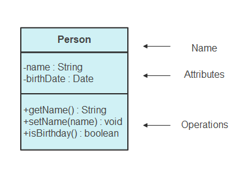

# Diagrames de clases

© Victor Prieto, Victor Asensio, Christopher Carrillo

## Definició

El diagrama de classes és el bloc principal del modelatge orientat a objectes. Es fa servir tant per la traducció de models detallats a codi de programació com pel modelat conceptual general de la sistemàtica de l'aplicació.

## Components d'un diagrama de classes



### **Classes**

#### **Tipus de classes especials**

- **Classe associació** : Una classe associació representa una relació entre dues o més classes. Indica que les instàncies d'una classe estan relacionades amb les instàncies d'una altra classe. Aquesta relació pot ser de diversos tipus, com ara un a un, un a molts, o molts a molts.

- **Classe interfície** : 

#### **Atributs**

- Els atributs són les propietats o característiques d'una classe. Són variables que emmagatzemen l'estat d'un objecte. Per exemple, en una classe "Cotxe", els atributs podrien ser "color", "marca" i "model".

#### **Mètodes**

#### **Relacions**

## Tipus de relacions

### **Associacions**

- **Associació** : L'associació és una relació entre dues o més classes que indica que una classe coneix l'existència de l'altra. Les associacions poden ser unidireccionals o bidireccionals.
      - **Associació unidireccional** : En una associació unidireccional, una classe coneix l'altra, però no a l'inrevés. Es representa amb una línia simple amb una fletxa que indica la direcció del coneixement.
      - **Associació bidireccional** : En una associació bidireccional, ambdues classes coneixen l'existència l'una de l'altra. Es representa amb una línia simple sense fletxes.

- **Composició**: La composició és una relació "té un" on la classe composta no pot existir sense la classe que la conté. Si la classe contenidora es destrueix, també ho fa la classe composta. Es representa amb un rombe negre.

- **Agregació**: L'agregació és similar a la composició, però la classe contenidora pot existir independentment de la classe que conté. Es representa amb un rombe buit.

### **Relacions a Nivell de Classe**

- **Generalització/Especialització** :

- **Realització** : La realització és una relació entre una interfície i una classe que implementa aquesta interfície. Es representa amb una línia puntejada amb una fletxa buida.

### **Relacions generals**

- **Dependència** : Una dependència entre dues classes és una relació entre aquestes, de manera que un canvi a un objecte de la classe proveïdora B pot forçar canvis a un objecte de la classe client A.

Una classe A depèn d'una altra classe B si:

    Un objecte de la classe B es fa servir de paràmetre a una operació de la classe A (visibilitat de paràmetre).
    Una operació de la classe A retorna un objecte de la classe B (visibilitat de paràmetre).
    Una operació de la classe A crea un objecte de la classe B i el fa servir dins d'un mètode, però sense mantenir-ne cap referència (visibilitat local).
    Una operació de la classe A fa servir un mètode estàtic de la classe B (visibilitat global).

REPRESENTACIÓ UML: una dependència d'una classe A respecte de B s'indica amb una fletxa puntejada que va de A fins a B.

### **Multiplicitat**

- La multiplicitat, situada a un extrem d'una associació, indica el nombre de possibles instàncies de la classe d'aquest extrem que es poden associar amb una instància de la classe de l'altre extrem.

REPRESENTACIÓ UML: una associació es representa amb una línia amb una punta de fletxa opcional que indica el paper de l'objecte en la relació, i una notació opcional a cada extrem que indica la multiplicitat de les instàncies de l'entitat, és a dir, el nombre d'objectes que participen en l'associació.

### **Restriccions**

Una restricció és una condició que tota implementació del disseny ha de satisfer. La restricció limita els valors que les entitats (objectes, classes, atributs, associacions...) poden prendre.

REPRESENTACIÓ UML: En un diagrama de classes les restriccions s'escriuen entre { } i es col·loquen vora l'entitat restringida.

### **Estereotips**

- Un estereotip permet afegir informació extra als elements del model (classes, dependències, color/tipus de rol…).

REPRESENTACIÓ UML: El nom d'un estereotip s'escriu entre << ... >> sobre del nom de l'element.

### **Associacions qualificades**

Un qualificador és un atribut d'una associació binària que serveix per a determinar unívocament un objecte o conjunt d'objectes d'una de les classes, la classe objectiu, que estan relacionats a través de l'associació.

Les associacions qualificades es fan servir com a identificadors i la seva multiplicitat acostuma a ser: 0..1, 1 i *. (El qualificador es fa servir com a clau de la Map).

REPRESENTACIÓ UML: Es representa per un rectangle que s'adjunta a l'extrem de l'associació situat al costat de la classe font, que és la classe oposada a la classe objectiu.

## **Paquets**

- Un paquet és una col·lecció d'elements del model (classes, altres paquets, casos d'ús…) relacionats lògicament. Permeten organitzar diagrames complexos, agrupant diversos elements. Es representen per rectangles amb petites pestanyes a la part superior. El nom del paquet es posa dins del rectangle o de la pestanya

### **Dependències entre paquets**

- Un paquet depèn d'un segon paquet, si els canvis fets al segon paquet poden forçar canvis en el primer. Naturalment, la dependència entre classes de diferents paquets implica la dependència entre els corresponents paquets. Els paquets continguts en altres paquets veuen tot allò que el paquet contenidor importa.

REPRESENTACIÓ UML: les dependències entre paquets s'indiquen amb fletxes puntejades.

## **Visibilitat**

Per especificar les visibilitats de la part d'una classe aquestes són les anotacions que s'han de posar abans del nom:

- **+** --> **Pública** : Permet que qualsevol objecte d'aquesta classe pugui accedir al mètode o atribut.
- **-** --> **Privada** : Limita l'accés al mètode o l'atribut de manera que només hi pugui accedir l'objecte de la mateixa classe.
- **#** --> **Protegida** : Permet que només accedeixi a l'atribut o mètode l'objecte de la mateixa classe i algun objecte d'una classe que hereti a partir d'aquesta.
- **/** --> **Derivada** (Es pot combinar amb les altres)
- **~** --> **Paquet** : Les classes es poden organitzar en paquets. Això s'acostuma a utilitzar quan tenim un conjunt de classes relacionades entre elles.


## Exemples de diagrames de classes

A continuació, es mostren alguns exemples de diagrames de classes per il·lustrar els conceptes explicats anteriorment:

### Exemple 1: Diagrama senzill amb associacions

Aquest diagrama mostra dues classes amb una associació bidireccional.

```
+----------------+       +----------------+
|    Classe A    |<----->|    Classe B    |
+----------------+       +----------------+
```

### Exemple 2: Diagrama amb composició i agregació

Aquest diagrama inclou una relació de composició i una d'agregació.

```
+----------------+<>-----+----------------+
| Classe Conten. |       | Classe Compos. |
+----------------+       +----------------+
    |
    |<>-------+-------------------+
    |         | Classe Agregació  |
    +---------+-------------------+
```

### Exemple 3: Diagrama amb herència i interfícies

Aquest diagrama mostra una classe base, una classe derivada i una interfície implementada.

```
+----------------+       +----------------+
|   Interfície   |<.....>| Classe Deriv.  |
+----------------+       +----------------+
      ^
      |
+----------------+
|   Classe Base  |
+----------------+
```

Amb aquests exemples, es pot visualitzar com es representen les diferents relacions i components en un diagrama de classes UML.
